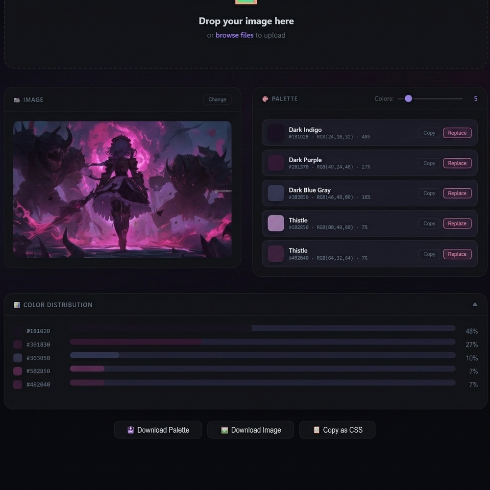

# 🎨 Color Palette Extractor

An interactive web tool that extracts the dominant color palette from any image.

## ✨ Features
- Drag & drop or click to upload an image
- Automatically extracts 8 dominant colors
- Click any color swatch to copy its HEX code to clipboard
- Works entirely in the browser — no backend needed

## 🖼️ Preview

## 🚀 How to use
1. Open the page
2. Drag & drop your image or click to select one
3. The color palette appears instantly below the image
4. Click any color to copy its HEX code

## 🛠️ Built with
- HTML5 Canvas API
- Vanilla JavaScript
- CSS3